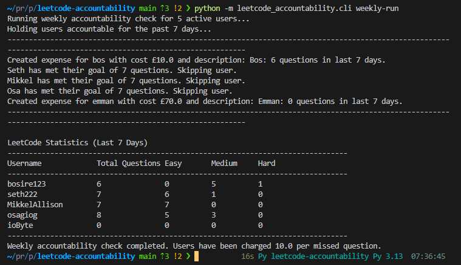
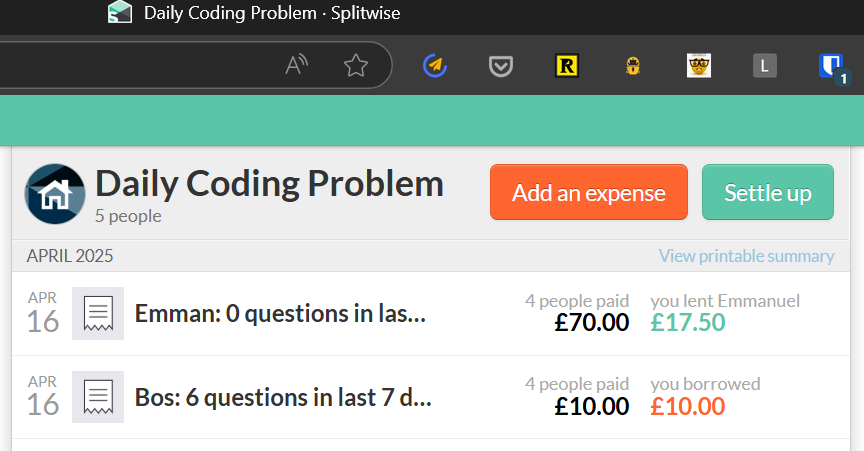
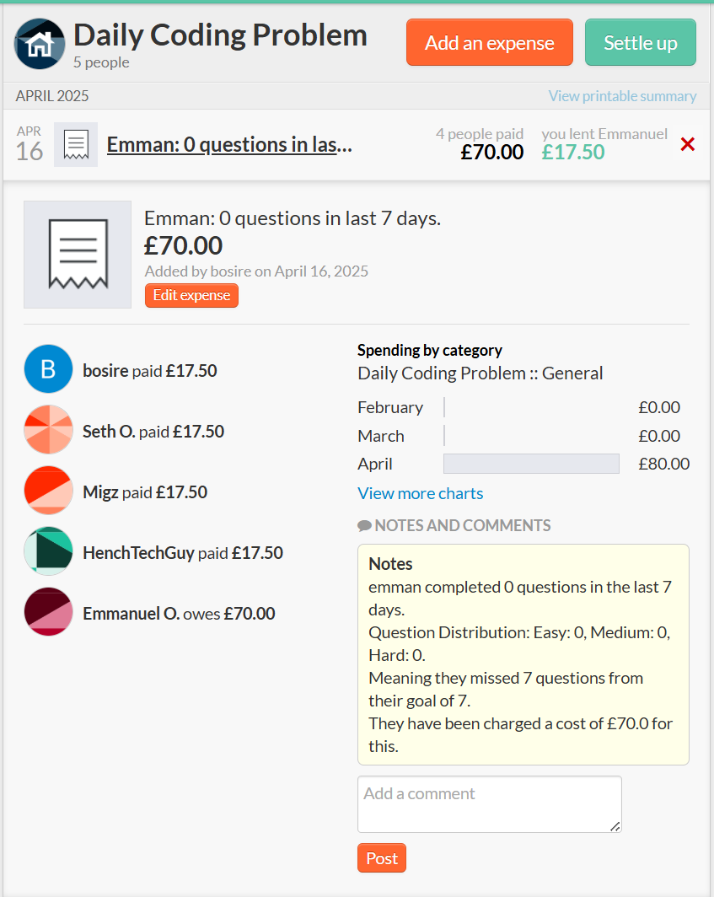

# LeetCode Accountability

A Python package for tracking LeetCode problem-solving activity across multiple users and holding them accountable.

## Screenshots

| Weekly Run Terminal Output | Splitwise Multiple Expenses | Splitwise Expense Details |
|:-------------------------:|:---------------------------:|:-------------------------:|
|  |  |  |

## Features

- Query the LeetCode GraphQL API to fetch user submissions
- Track problems solved by difficulty level (Easy, Medium, Hard)
- View statistics for multiple users over a specified time period
- Command-line interface for quick access to statistics
- Integration with Splitwise for financial accountability
- Configurable user settings via JSON configuration

## Installation

1. Clone this repository
2. Install the required dependencies from requirements.txt:

```bash
pip install -r requirements.txt
```

3. Set up your environment variables (see Configuration section)

## Usage

### Command-line Interface

The package provides two main commands:

#### Stats Command

View LeetCode submission statistics for specified users:

```bash
# Get stats for multiple users over the last 7 days (default)
python -m leetcode_accountability.cli stats user1 user2 user3

# Specify a custom number of days
python -m leetcode_accountability.cli stats user1 user2 --days 30
```

#### Weekly Run Command

Run the weekly accountability check for all active users. This will charge users for missed questions via Splitwise and print their stats:

```bash
# Run weekly accountability check with default settings (7 days, $10 per missed question)
python -m leetcode_accountability.cli weekly_run

# Customize the lookback period and cost per question
python -m leetcode_accountability.cli weekly_run --days 14 --cost-per-question 15.0
```

## Configuration

### User Configuration

Users are configured in the `leetcode_accountability/users_data.json` file. This file contains user information including:

- LeetCode username
- Splitwise ID and group ID
- Email address
- Minimum required questions per week
- Active status

Example user configuration:

```json
{
  "username": {
    "name": "username",
    "leetcode_id": "leetcode_username",
    "splitwise_id": "12345678",
    "email_address": "user@example.com",
    "splitwise_group_id": "87654321",
    "min_questions": 7,
    "is_active": 1
  }
}
```

### Managing Users

To add a new user:

1. Add a new entry to the `users_data.json` file following the format above
2. Set `is_active` to `1` to include them in the weekly accountability check

To deactivate a user:

1. Set their `is_active` value to `0` in the `users_data.json` file

To modify user settings:

1. Edit the corresponding values in the `users_data.json` file
2. Changes will take effect the next time the application runs

### Environment Variables

Create a `.env` file in the root directory with the following variables:

```bash
SPLITWISE_API_KEY=your_splitwise_api_key
```

## GitHub Actions

The repository includes two automated workflows:

1. **LeetCode Accountability Weekly Run** (weekly-run.yml):
   - Runs automatically every Monday at 6 AM London time (5 AM UTC)
   - Can also be triggered manually via workflow_dispatch
   - Executes the weekly accountability check for all active users
   - Runs the `weekly-run` CLI command which charges users for missed questions via Splitwise and generates statistics

2. **LeetCode Stats Report** (stats-report.yml):
   - Runs automatically every Monday at 6 AM London time (5 AM UTC)
   - Can be triggered manually with customizable inputs:
     - `usernames`: Space-separated LeetCode usernames (default: 'bosire123 seth222 osagiog ioByte')
     - `days`: Number of days to look back (default: 7)
   - Generates a statistics report for the specified users over the specified time period
   - Runs the `stats` CLI command with the provided parameters

These GitHub Actions automate the accountability and reporting processes, ensuring regular tracking of LeetCode activity without manual intervention.

## License

MIT
